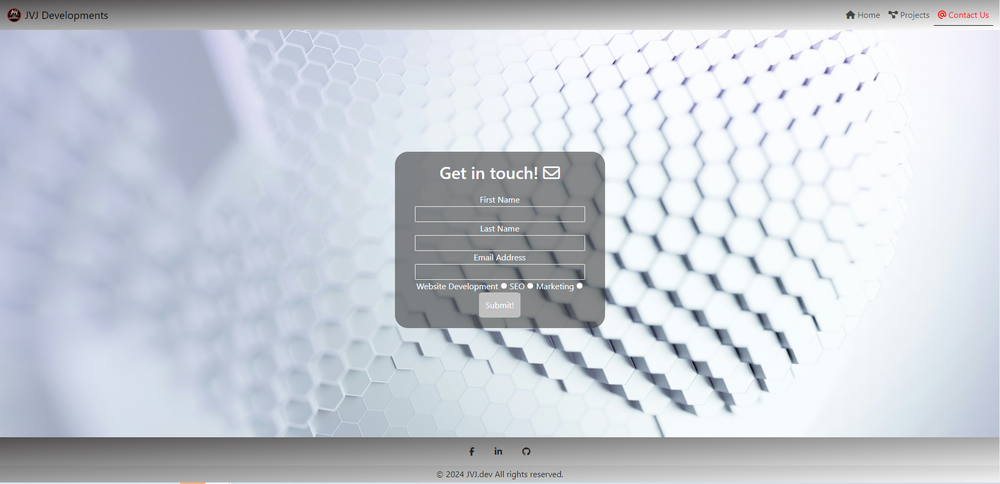

---

# *JVJ Developments*

My JVJ Developments website allows people to not just learn about the company "JVJ Developments" but also information about myself and what makes me want to pursue this career. Additionally, viewers can also see the mini-projects undertaken leading up to the first milestone project. Viewers of the website could quickly contact the company about various services such as SEO, Marketing and of course, web development.

The site can be accessed by this [link](https://berniemachub.github.io/Milestone-Project-1/)

---

## User Experience (UX)

### User Stories

#### First-Time Visitor Goals

- I want to get useful information about this person.
- I want the site to work on my chosen device.
- I want to find my way around the site easily.

#### Returning Visitor Goals

- I want to be able to explore more of what this person has to offer.

#### Frequent Visitor Goals

- I want to have the option to reach out and communicate with this person.

---

### Colour Scheme

As the page is meant to be a personal profile, I based my color scheme on Manchester United's Red, White and Black. With that as my starting point, I initially opted for a linear gradient background but ended up changing it to a background image across all pages. I found the image on [unsplash](https://unsplash.com/photos/a-white-abstract-background-with-hexagonal-shapes-rAH_wlhdURM).

I based my logo on the same colour scheme using a free logo made on [canva](https://canva.com).

I then decided i wanted to change from the black and white idea to a silver gradient for the Nav bar and Footer.

   
In my CSS file, I declared some custom variables for my colouring scheme that was implemented throughout the site. it was very handy being able to quickly edit the CSS using the variables rather than having to remember the specific colour I wanted or typing out a long gradient syntax.

- I used 3 different types of gradients, mostly using the same colours, just reversing and switching the colours around so you could visibly see a difference if one was used as a backdrop for another.

- I initially intended on using the following colours for my background '#000000', '#ffffff' and 'red'.

- as mentioned above I ended up changing this to an image background and utilised the following gradients for the navbar, footer, 'about me' hero image, projects cards and skills section.

linear-gradient(to bottom right, black, silver);
linear-gradient(to top left, black, silver);
linear-gradient(to top left, white, rgb(80, 78, 78));

- my text colour scheme didn't change from the start, utilising 'red', '#000000' and '#ffffff'.

- to show my understanding, I have used a variety of colour formats for my variables such as hexadecimal and RGBA.

## Typography

I used Google Fonts for the text across the entire site.

- The font used across the site is [Ubuntu](https://fonts.google.com/specimen/Ubuntu?preview.text=Mark.dev&query=Ubuntu). The text is simple and very easy to read all around.

## Imagery

- As mentioned above I originally intended on using a gradient for my background but ended up changing it to a background image to make the rest of the webpages pop off the background more.

## Wireframes

Wireframes were created for various devices using Balsamiq

   

## Features

The website is set across 4 pages, made up of a Home page, a Projects page, a Contact page and a form response page (this page is only visible when the contact form is submitted).

Each page is responsive across a range of popular devices.

- Each page features a Favicon in the browser tab

- The title of the page is displayed site-wide and is also used to navigate back to the home page.

### Home Page

The home page displays key information about the purpose of the website, the services provided as well as information about myself.

### Projects

The projects page displays the projects I have worked on so far. Each card contains a preview image of the targetted website, the title of the page and a brief overview of why the task was undertaken. Links are provided to a live version of the project deployed on Github.

### Contact

This is a very simple form that allows the user to contact me, they can submit the form and wait for a response, or this method allows them to utilise radio options to pick what servers they are seeking. 

## Form Submit

This page informs the user that the form was submitted successfully, it also provides the user with a second option. The second method allows the user to send a direct email, this allows them to give more detail about the services they require.

### Site Wide

All pages have a Navigation Bar and Footer, all containing links to the homepage, contact, and projects for easy maneuverability across all pages. The footer also contains various social links such as Facebook, Linkedin and Github.

### Future Improvements/Changes

### Accessibility

#### Normal Colour Scheme

#### Responsive Colour Scheme

---

## How It Was Built

### Languages Used

The languages that have been used throughout the development of the website are HTML & CSS.

### Libraries, Websites & Programs Used

- [VSCode](https://code.visualstudio.com/) - IDE used in the project.
- [Git](https://git-scm.com/) - Version control.
- [GitHub](https://github.com/) - Stores all files relating to the project.
- [Balsamiq](https://balsamiq.com/) - Wireframes used to mock-up the site.
- [Canva](https://www.canva.com) - Website logo.
- [Google Fonts](https://fonts.google.com/) - Font used across the site.
- [Font Awesome](https://fontawesome.com/) - Brand icons.
- [unsplash](https://unsplash.com/photos/a-white-abstract-background-with-hexagonal-shapes-rAH_wlhdURM) - Background image.
- [Google Dev Tools](https://developer.chrome.com/docs/) - Dev tools.

---

## Deployment & Local Development

### Deployment

### Local Development

#### How to Fork

#### How to Clone

---

## Testing

### Solved Bugs

### Known Bugs

---

## Credits

### Code Used

### Page Content

### Media

### Acknowledgements

