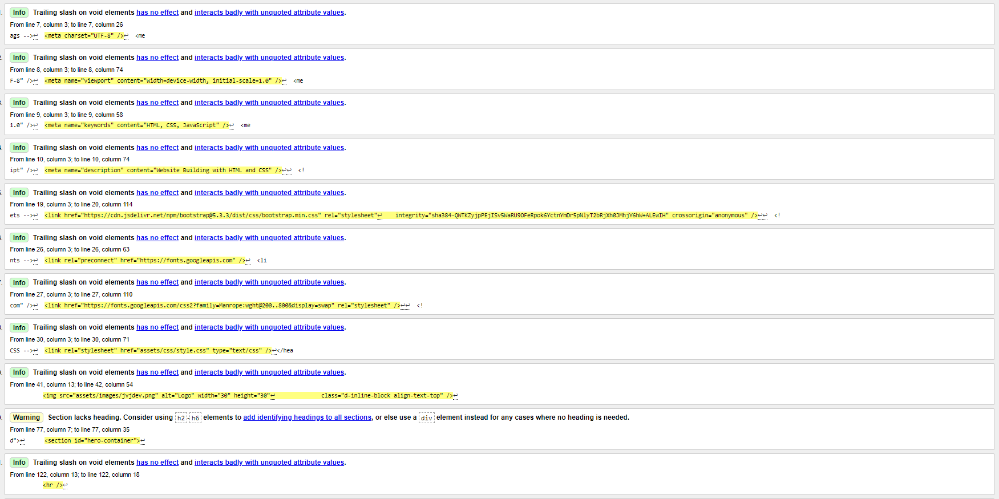
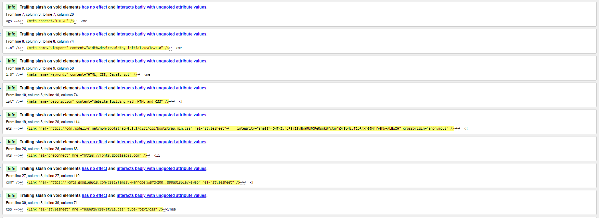
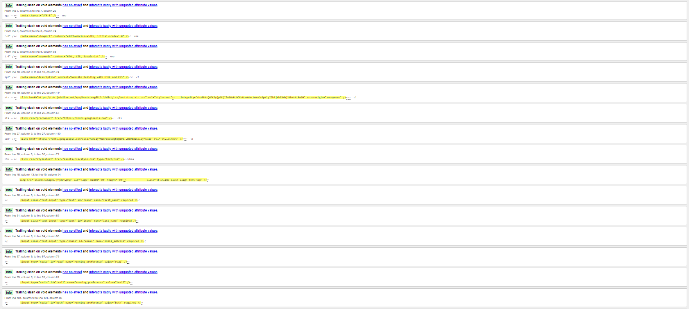
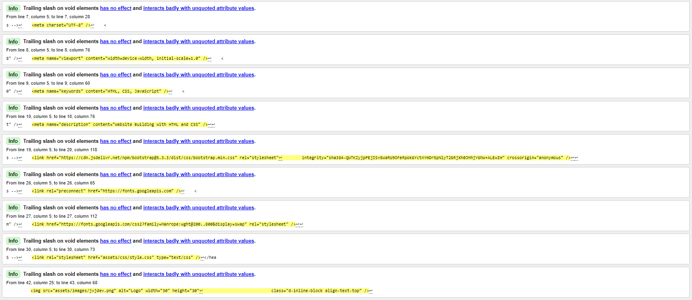
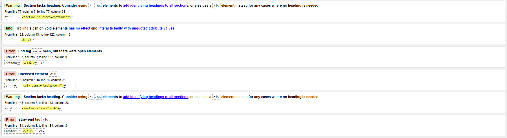
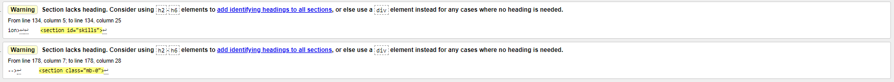
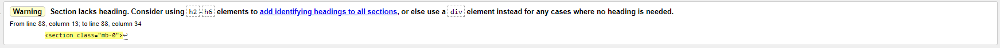

# TESTING

## Manual testing

| feature | action | expected result | tested | passed | comments |
| --- | --- | --- | --- | --- | --- |
| Navbar | | | | | |
| Home Link 1 | Click on the "Home" link | The user is redirected to the main page | Yes | Yes | - |
| Home Link 2 | Click on the "JVJ Developments" Text | The user is redirected to the main page | Yes | Yes | - |
| Home Link 3 | Click on the "JVJ Developments" Logo | The user is redirected to the main page | Yes | Yes | - |
| Projects | Click on the "Projects" link | The user is redirected to the projects page | Yes | Yes | - |
| Contact | Click on the "Contact" link | The user is redirected to the contact page | Yes | Yes | - |
| Footer | | | | | |
| Facebook icon in the footer | Click on the Facebook icon | The user is redirected to the Facebook page | Yes | Yes | - |
| Linkedin icon in the footer | Click on the Linkedin icon | The user is redirected to the Linkedin page | Yes | Yes | - |
| GitHub icon in the footer | Click on the GitHub icon | The user is redirected to the GitHub page | Yes | Yes | - |
| Home page | | | | | |
| "Get in touch" button in Callout section | Click on the "Get in touch" button | The user is redirected to the contact page | Yes | Yes | - |
| Projects page | | | | | |
| "Visit Site" button in Coders Coffeehouse Card | Click on the "Visit Site" button | The user is redirected to the contact page | Yes | Yes | - |
| "Visit Site" button in Love Running Card | Click on the "Visit Site" button | The user is redirected to the contact page | Yes | Yes | - |
| "Visit Site" button in Whiskey Drop | Click on the "Visit Site" button | The user is redirected to the contact page | Yes | Yes | - |
| "HTML box" button in skills section | Click on the "HTML box" button | The user is redirected to the contact page | Yes | Yes | - |
| "CSS box" button in skills section | Click on the "CSS box" button | The user is redirected to the contact page | Yes | Yes | - |
| "Javascript box" button in skills section | Click on the "Javascript box" button | The user is redirected to the contact page | Yes | Yes | - |
| Contact page | | | | | |
| First name input | Enter the first name | The first name is entered | Yes | Yes | If user doesn't enter the first name, the error message appears |
| Last name input | Enter the last name | The last name is entered | Yes | Yes | If user doesn't enter the last name, the error message appears |
| Email input | Enter the email | The email is entered | Yes | Yes | If user doesn't enter the email, the error message appears. If user enters not valid email, the error message appears |
| Radio Options | Click one of the Radio Options | The checkbox is checked | Yes | Yes | If user doesn't enter select an option, the error message appears. |
| "Submit" button | Click on the "Submit" button | The user is redirected to the response page | Yes | Yes | - |
| Response page | | | | | |
| "Email" link | Click on the "Email" link | The user is redirected to their default email platform | Yes | Yes | - |

## Validator testing - HTML

### Info messages

#### Home, Projects, Contact and Response Page
- All Info messages have been ignored, no effect on page performance and is caused by VScode extension 'Beautify'

### Warnings

#### Home, Projects, Contact and Response Page
- Warnings have been ignored, regarding sections not having headings, Tutor agreed it can be dismissed aslong as acknowledging when debuging.

### Errors

#### Home
- Removed Stray </main> tag
- fixed the unclosed the 
 element
- Removed Stray 
 tag

#### Projects

#### Contact
- No Errors Present.

#### Response
- No Errors Present.

## Validator testing - CSS

#### Errors
- Removed border for .contact-us-btn
- Removed padding and incorrect value for .icon-text
- Removed padding on #hero-logo-border
- Removed Background for #hero-image
- Fixed border on .card
- Fixed all border issues relating to the .skills-containers

#### Warnings
- Ignored, just letting me know that it's not going to validate the imported style sheet. It's not an error, just some information for me.

