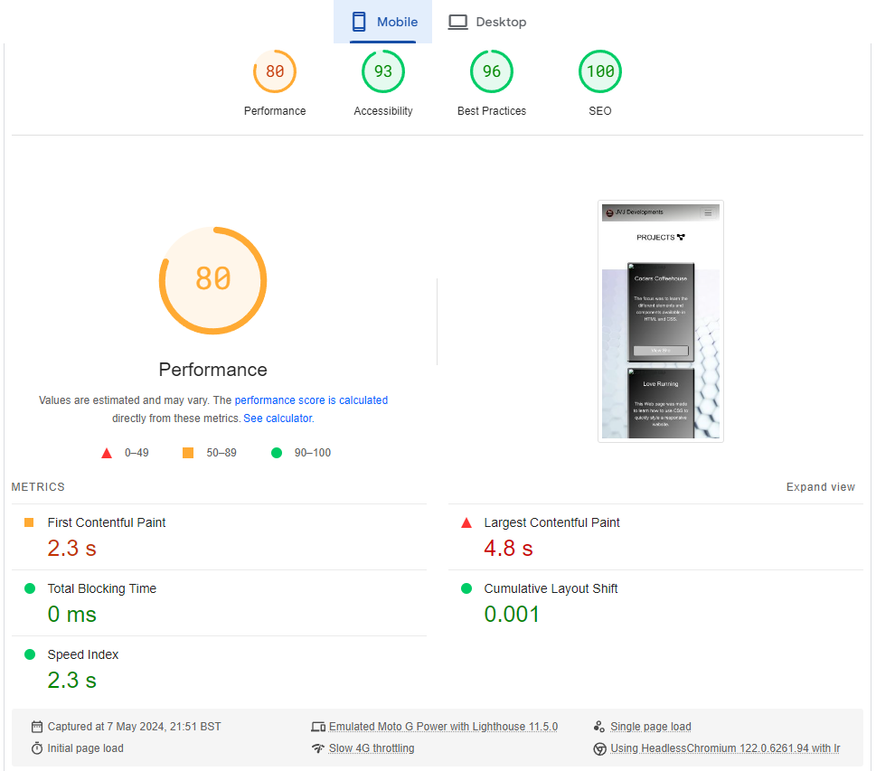

# TESTING

## Manual testing

| feature | action | expected result | tested | passed | comments |
| --- | --- | --- | --- | --- | --- |
| Navbar | | | | | |
| Home Link 1 | Click on the "Home" link | The user is redirected to the main page | Yes | Yes | - |
| Home Link 2 | Click on the "JVJ Developments" Text | The user is redirected to the main page | Yes | Yes | - |
| Home Link 3 | Click on the "JVJ Developments" Logo | The user is redirected to the main page | Yes | Yes | - |
| Projects | Click on the "Projects" link | The user is redirected to the projects page | Yes | Yes | - |
| Contact | Click on the "Contact" link | The user is redirected to the contact page | Yes | Yes | - |
| Footer | | | | | |
| Facebook icon in the footer | Click on the Facebook icon | The user is redirected to the Facebook page | Yes | Yes | - |
| Linkedin icon in the footer | Click on the Linkedin icon | The user is redirected to the Linkedin page | Yes | Yes | - |
| GitHub icon in the footer | Click on the GitHub icon | The user is redirected to the GitHub page | Yes | Yes | - |
| Home page | | | | | |
| "Get in touch" button in Callout section | Click on the "Get in touch" button | The user is redirected to the contact page | Yes | Yes | - |
| Projects page | | | | | |
| "Visit Site" button in Coders Coffeehouse Card | Click on the "Visit Site" button | The user is redirected to Coders Coffeehouse website | Yes | Yes | - |
| "Visit Site" button in Love Running Card | Click on the "Visit Site" button | The user is redirected to Love Running website | Yes | Yes | - |
| "Visit Site" button in Whiskey Drop | Click on the "Visit Site" button | The user is redirected to Whiskey Drop website | Yes | Yes | - |
| "HTML box" button in skills section | Click on the "HTML box" button | The user is redirected to HTML Google page | Yes | Yes | - |
| "CSS box" button in skills section | Click on the "CSS box" button | The user is redirected to the CSS Google page | Yes | Yes | - |
| "Javascript box" button in skills section | Click on the "Javascript box" button | The user is redirected to the Javascript Google page | Yes | Yes | - |
| Contact page | | | | | |
| First name input | Enter the first name | The first name is entered | Yes | Yes | If user doesn't enter the first name, the error message appears |
| Last name input | Enter the last name | The last name is entered | Yes | Yes | If user doesn't enter the last name, the error message appears |
| Email input | Enter the email | The email is entered | Yes | Yes | If user doesn't enter the email, the error message appears. If user enters not valid email, the error message appears |
| Radio Options | Click one of the Radio Options | The checkbox is checked | Yes | Yes | If user doesn't enter select an option, the error message appears. |
| "Submit" button | Click on the "Submit" button | The user is redirected to the response page | Yes | Yes | - |
| Response page | | | | | |
| "Email" link | Click on the "Email" link | The user is redirected to their default email platform | Yes | Yes | - |

## Validator testing - HTML

Info tags have been ignored due to being caused by 'Prettier' Extension in vs.code and has no consequence on webpage.
warnings also ignored due to having no conseqeunce either.

images of results shown below for Home, Projects, Contact and Response page.

## Validator testing - CSS

No errors present in CSS. Ignored the warnings, just letting me know that it's not going to validate the imported style sheet. It's not an error, just some information for me.

### Bugs

### Lighthouse

- First tests i ran were scoring green on desktop except projects, and all in the top quarter (75%+) on mobile platforms.

Desktop Results:

Mobile Results:

I made improvements to Projects page Performance by reducing the image sized, results below:

## Responsiveness

I used Responsive Viewer extension for google chrome to test the responsiveness on various differnet platforms to maintain a uniform appearance across all devices.

Below is how all pages (Home, Projects, Contact and Response) will look across a Mobile device.

Below is how all pages (Home, Projects, Contact and Response) will look across a Medium device such as a tablet.

Below is how all pages (Home, Projects, Contact and Response) will look across a Medium device such as a desktop monitor.

